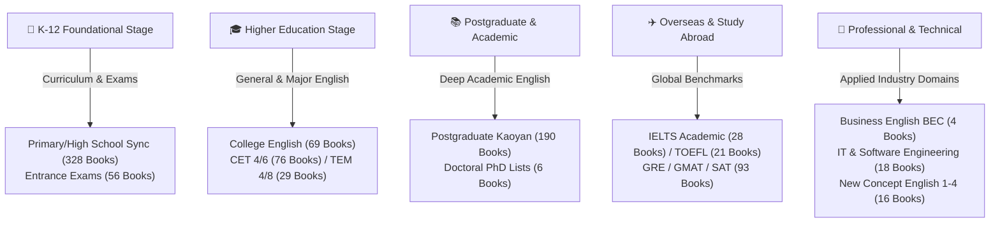
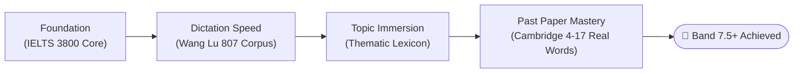

  

  # 🌐 Ultimate English Vocabulary Vault

  

    <strong>960+ Curated Lexicons • Standard IPA Phonetics • Authoritative Definitions • Seamless Anki / Quizlet / Excel Integration</strong>
  

  

    <b>🇬🇧 English</b> &nbsp;•&nbsp;
    <a href="./README_zh.md">🇨🇳 简体中文</a> &nbsp;•&nbsp;
    <a href="./README_ja.md">🇯🇵 日本語</a> &nbsp;•&nbsp;
    <a href="./README_es.md">🇪🇸 Español</a>
  

  

    
    
    
    
    
    
    
  

  

    🚀 An all-in-one, structured, open-source English vocabulary repository for language learners worldwide. From foundational K-12 to Doctoral research, and from IELTS/TOEFL to software engineering, everything is ready out of the box.
  

---

## 📑 Table of Contents

- [📖 Vision & Overview](#-vision--overview)
- [🌟 Key Highlights & Advantages](#-key-highlights--advantages)
- [🎯 Learning Pathways](#-learning-pathways)
- [📂 Full Library Taxonomy (960+ Books)](#-full-library-taxonomy-960-books)
- [🏆 Featured Subject Focus](#-featured-subject-focus)
  - [🎓 IELTS Prep Suite (28 Books)](#-ielts-prep-suite-28-books)
  - [✈️ TOEFL iBT Focus (21 Books)](#️-toefl-ibt-focus-21-books)
  - [📘 New Concept English (Books 1-4 + 108 Master Lecture Notes)](#-new-concept-english-books-1-4--108-master-lecture-notes)
  - [💻 IT, Computer Science & Developer English](#-it-computer-science--developer-english)
- [🛠️ Tool Integration & Import Guides](#️-tool-integration--import-guides)
  - [📱 Importing into Anki (Spaced Repetition)](#-importing-into-anki-spaced-repetition)
  - [📝 Importing into Quizlet](#-importing-into-quizlet)
  - [📖 Importing into Mobile Dictionary Apps (Eudic / Youdao)](#-importing-into-mobile-dictionary-apps-eudic--youdao)
- [📋 Data Schema & Standardization](#-data-schema--standardization)
- [🗺️ Project Roadmap](#️-project-roadmap)
- [🤝 Contributing & Community Guidelines](#-contributing--community-guidelines)
- [⭐ Star History](#-star-history)
- [📄 License & Legal Disclaimer](#-license--legal-disclaimer)

---

## 📖 Vision & Overview

When preparing for major language proficiency examinations or daily vocabulary acquisition, finding well-formatted, complete, and typo-free word lists is often surprisingly difficult. Many resources online suffer from corrupted encodings, missing phonetics, fragmented files, or inconsistent column layouts.

**English Vocabulary Vault** is an open-source initiative designed to provide a unified, clean, and comprehensive collection of English vocabulary datasets:
- **Massive Scope**: Over **960+ distinct vocabulary books** covering K-12 schooling, college exams (CET-4/6, TEM-4/8), postgraduate & PhD entrances, overseas examinations (IELTS, TOEFL, GRE, GMAT, SAT), and specialized industry English.
- **High Quality**: Standardized in `.xlsx` and `.txt` formats with International Phonetic Alphabet (IPA) transcriptions and comprehensive contextual definitions.
- **Ready for Anki & Flashcards**: Engineered for instant zero-hassle import into spaced repetition software (Anki, Quizlet, RemNote, Eudic).

---

## 🌟 Key Highlights & Advantages

| Dimension | Description |
| :--- | :--- |
| **📦 Vast Coverage** | Over 960+ books and hundreds of thousands of word tokens categorized in one central repository. |
| **🗂️ Structured Taxonomy** | Hierarchically partitioned by educational stage, exam type, and domain for effortless navigation. |
| **✨ Standard IPA Phonetics** | Strictly formatted using standard International Phonetic Alphabet characters to prevent garbled text. |
| **🔄 Alphabetical & Random Orders** | Major exam lists are supplied in both alphabetical and randomized (乱序) orders to bypass positional recall bias. |
| **📑 Comprehensive Lecture Notes** | Beyond pure word lists, the New Concept English module contains **108 in-depth lecture notes (Docx/PDF)**. |
| **🆓 100% Free & Open Source** | Completely free for students, teachers, and developers around the globe under Creative Commons license. |

---

## 🎯 Learning Pathways

---

## 📂 Full Library Taxonomy (960+ Books)

Click on any directory link below to browse and download vocabulary sets directly:

| # | Directory & Category | Book Count | Description & Scope |
| :-: | :--- | :-: | :--- |
| **01** | [1.全国各大教材版本中小学同步](./1.全国各大教材版本中小学同步/) | **328 Books** | Synchronized primary, middle, and high school textbooks (PEP, FLTRP, BNUP, Oxford, etc.) |
| **02** | [2.中考](./2.中考/) | **9 Books** | High school entrance exam (Zhongkao) syllabus, core collocations, and pocket flashcards |
| **03** | [2.高考](./2.高考/) | **47 Books** | National College Entrance Exam (Gaokao) 3500 words, high-frequency sprint sets, and randomized lists |
| **04** | [3.大学英语](./3.大学英语/) | **69 Books** | Comprehensive College English, New Horizon, Intensive College Reading Series |
| **05** | [3.四级](./3.四级/) | **30 Books** | College English Test Band 4 (CET-4) frequency lists, syllabus flashcards, and pocket reviews |
| **06** | [3.专四](./3.专四/) | **15 Books** | Test for English Majors Band 4 (TEM-4) syllabus, contextual memory, and literature vocabulary |
| **07** | [4.六级](./4.六级/) | **46 Books** | College English Test Band 6 (CET-6) advanced lexicon, sprint lists, and categorized flashcards |
| **08** | [4.专八](./4.专八/) | **14 Books** | Test for English Majors Band 8 (TEM-8) advanced literary and syntactic vocabulary |
| **09** | [5.考研](./5.考研/) | **190 Books** 🔥 | Postgraduate Master's Entrance Exam core, Red Book, frequency tiers, and past exam testbanks |
| **10** | [6.研究生](./6.研究生/) | **9 Books** | Graduate English, public master's English, and advanced academic communicative reading |
| **11** | [6.考博](./6.考博/) | **6 Books** | Doctoral Candidate (PhD) 10,000 vocabulary handbooks and weekly schedules |
| **12** | [7.雅思](./7.雅思/) | **28 Books** 🏆 | IELTS categorized topic lexicon, Wang Lu 807 series (L/S/R/W), Cambridge 4-17 real test vocabulary |
| **13** | [7.托福](./7.托福/) | **21 Books** 🏆 | TOEFL iBT topic categorization, 21-Day Breakthrough, randomized memory sets |
| **14** | [8.商务英语](./8.商务英语/) | **4 Books** | Cambridge Business English Certificate (BEC) Preliminary, Vantage, and Higher |
| **15** | [8.国际英语](./8.国际英语/) | **12 Books** | Cambridge Interchange (Intro-Level 3), Longman Side by Side (Books 1-4) |
| **16** | [8.新世纪英专](./8.新世纪英专/) | **12 Books** | Integrated Courses for English Majors (Books 1-8 and supplements) |
| **17** | [8.新概念英语](./8.新概念英语/) | **16 Books + Notes** | New Concept English Books 1-4 & Junior editions, **plus 108 Master Lecture Notes (Docx/PDF)** |
| **18** | [9.扇贝英语（IT）](./9.扇贝英语（IT）/) | **18 Books** 💻 | Computer Science English, Python/Java developer vocabulary, and NAWL academic lists |
| **19** | [9.其他（更多）](./9.其他（更多）/) | **93 Books** | SAT, GRE Red Book, GMAT, Latin & Greek roots and affixes, and advanced journalistic vocabulary |

---

## 🏆 Featured Subject Focus

### 🎓 IELTS Prep Suite (28 Books)

Tailored for IELTS candidates targeting Band 7.0+ across Listening, Speaking, Reading, and Writing:

| Category | Resource Title | Key Strength |
| :--- | :--- | :--- |
| **📘 Topic Classification** | `IELTS词汇词以类记.xlsx` | Grouped by environmental, educational, technological, and cultural themes |
| **📙 807 Core Corpus** | `王陆807雅思词汇听力/口语/阅读/写作.xlsx` | The gold standard for listening dictation and spelling accuracy |
| **📗 Past Real Tests** | `雅思真词汇（第3-6版）.xlsx` | Derived directly from Cambridge IELTS 4–17 official test banks |
| **⚡ Rapid Sprint** | `7天搞定雅思高频核心词.xlsx` | High-frequency essentials for the final 1–2 weeks before test day |

---

### ✈️ TOEFL iBT Focus (21 Books)

Designed for the interdisciplinary academic scenarios in TOEFL reading and listening:
- `TOEFL词汇词以类记.xlsx`: Cross-disciplinary vocabulary spanning astronomy, geology, biology, anthropology, and fine arts.
- `托福核心词汇21天突破.xlsx`: 21-day structured breakthrough plan for high-frequency academic verbs and descriptors.
- `托福词汇乱序版.xlsx`: Randomized sorting to eliminate positional mnemonic dependency.

---

### 📘 New Concept English (Books 1-4 + 108 Master Lecture Notes)

> Detailed lesson breakdown and syllabus guide: [8.新概念英语/README.md](./8.新概念英语/README.md)

This repository hosts an exhaustive digital companion for *New Concept English*:
1. **Vocabulary Sheets (`.xlsx`)**:
   - Classic Series: Books 1 to 4 with IPA phonetics and clear definitions.
   - Junior Edition: Starter A/B to 5A/5B (12 full decks).
2. **Master In-depth Lecture Notes (`.docx` & `.pdf`)**:
   - **Book 3 (Developing Skills)**: Lessons 01–60 complete detailed notes, including a combined **47.4 MB PDF compilation**.
   - **Book 4 (Fluency in English)**: Lessons 01–48 complete analytical guides on British prose style, syntactic structures, and rhetoric.

---

### 💻 IT, Computer Science & Developer English

Curated specifically for software engineers, CS majors, and tech professionals working in international environments:
- `计算机专业英语词汇.xls`: Operating systems, computer networks, algorithms, and distributed system terminology.
- `Python词汇（基础版）.xls` & `JAVA程序员英语通关单词.xls`: Programming language keywords, syntax conventions, and common API terms.
- `雅思NAWL学术词汇.txt`: The New Academic Word List (NAWL) for reading and authoring technical whitepapers and research publications.

---

## 🛠️ Tool Integration & Import Guides

All files use standard `.xlsx` or `.txt` encoding, making them universally compatible across flashcard platforms.

### 📱 Importing into Anki (Spaced Repetition)

1. Open any `.xlsx` file in Excel or LibreOffice, click **File** -> **Save As**, and choose **CSV (Comma delimited) (*.csv)** with **UTF-8** encoding.
2. Open desktop [Anki](https://apps.ankiweb.net/), click **File** -> **Import**.
3. Select your exported `.csv` file. In the configuration window:
   - **Card Type**: Choose `Basic` or your customized flashcard template.
   - **Field Mapping**:
     - Column 1 -> `Front` (English word)
     - Column 2 -> `Phonetic` (IPA transcription)
     - Column 3 -> `Back` (Meaning / Definition)
4. Click **Import**. Anki will automatically apply SuperMemo/SM-2 spaced repetition intervals!

### 📝 Importing into Quizlet

1. Log in to [Quizlet](https://quizlet.com/) and click **Create** -> **Study Set**.
2. Click **Import from Word, Excel, Google Docs, etc.**.
3. Copy two columns from the Excel file (e.g. Word and Definition) using `Ctrl+C`.
4. Paste into the Quizlet import textarea. Select "Tab" between term and definition, and "New line" between cards.
5. Click **Import** to start practice games, tests, and mobile flashcards.

### 📖 Importing into Mobile Dictionary Apps (Eudic / Youdao)

- **Eudic (欧路词典)**: Go to **Vocabulary Book** -> **Manage** -> **Import Words**, and select the `.xlsx` file directly.
- **Youdao / Shanbay**: Export the word column to a single `.txt` file (one word per line) and import via the desktop client to sync seamlessly across mobile devices.

---

## 📋 Data Schema & Standardization

To maintain consistency and reliable programmatic parsing across hundreds of decks, files adhere to the following schema:

| Column Name (CN) | Field Name (EN) | Data Type | Description & Example |
| :--- | :--- | :--- | :--- |
| **单词** | `Word` | String | Base form of the English term/collocation (e.g., `resilience`) |
| **音标** | `Phonetic` | String | Standard International Phonetic Alphabet (IPA) with slashes (e.g., `/rɪˈzɪliəns/`) |
| **释义** | `Definition` | String | Part of speech followed by precise definition (e.g., `n. 恢复力；弹力；适应力`) |
| **例句** *(Optional)* | `Sentence` | String | Authentic usage context or past exam reference sentence |

---

## 🗺️ Project Roadmap

- [x] Complete comprehensive audit and structured indexing of 960+ vocabulary datasets
- [x] Deeply integrate New Concept English Books 1-4 with 108 Master Lecture Notes (Docx/PDF)
- [x] Implement enterprise-grade multilingual README documentation (EN / ZH / JA / ES)
- [ ] **Automated Deck Builder**: Release an open-source Python script to compile `.xlsx` files into `.apkg` files automatically
- [ ] **Quality Assurance**: Community and AI-assisted proofreading for legacy phonetic symbols and rare archaic definitions
- [ ] **Cambridge IELTS 18 & 19 Update**: Extract and curate the latest Cambridge test vocabulary
- [ ] **Web-based Lexicon Search**: Deploy a zero-dependency, lightning-fast GitHub Pages search tool

---

## 🤝 Contributing & Community Guidelines

Contributions from language learners, educators, and developers worldwide are warmly welcome! Whether fixing a typo, adding missing phonetics, or contributing a new dataset:

1. **Fork** this repository to your own GitHub account.
2. **Create a branch** for your update: `git checkout -b feat/add-cambridge-19`
3. **Commit** your changes following conventional commits: `git commit -m "docs: fix phonetic transcription in CET-4 abandon"`
4. **Push and Open a Pull Request**. We review and merge community PRs regularly!
5. Have ideas or found bugs? Open a [GitHub Issue](https://github.com/lilinji/English/issues).

---

## ⭐ Star History

If this repository has empowered your English learning or exam preparation, please show your support with a **Star** ⭐!

---

## 📄 License & Legal Disclaimer

> ⚠️ **Disclaimer**
>
> 1. All vocabulary datasets and lecture notes in this repository are aggregated from publicly available learning materials on the internet and community submissions. They are provided solely for non-commercial personal study, academic research, and self-improvement.
> 2. Trademarks, exam syllabus copyrights, and book copyrights belong to their respective authors, publishers, or testing bodies.
> 3. Redistribution for commercial profit is strictly prohibited. If any copyright holder believes their rights are infringed, please open an Issue with proof of ownership, and we will promptly review and remove the material in accordance with relevant laws.

---

  💡 **Empower Your Learning Journey — One Word at a Time.**
  
  **Made with ❤️ by [Ringi](https://github.com/lilinji) & Community Contributors**

  [⬆ Back to Top](#-ultimate-english-vocabulary-vault)

