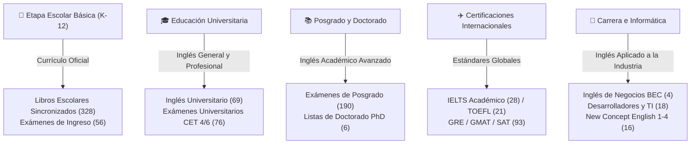

  

  # 🌐 Bóveda Definitiva de Vocabulario en Inglés (English Vocabulary Vault)

  

    <strong>Más de 960 Léxicos Seleccionados • Fonética IPA Estándar • Definiciones de Autoridad • Compatible con Anki / Quizlet / Excel</strong>
  

  

    <a href="./README.md">🇬🇧 English</a> &nbsp;•&nbsp;
    <a href="./README_zh.md">🇨🇳 简体中文</a> &nbsp;•&nbsp;
    <a href="./README_ja.md">🇯🇵 日本語</a> &nbsp;•&nbsp;
    <a href="./README_es.md"><b>🇪🇸 Español</b></a>
  

  

    
    
    
    
    
    
    
  

  

    🚀 Un repositorio de código abierto todo en uno para estudiantes y profesionales del inglés en todo el mundo. Desde la escuela primaria hasta investigaciones de doctorado, exámenes IELTS/TOEFL e inglés técnico de TI.
  

---

## 📑 Tabla de Contenidos

- [📖 Visión y Descripción General](#-visión-y-descripción-general)
- [🌟 Características Clave y Ventajas](#-características-clave-y-ventajas)
- [🎯 Rutas de Aprendizaje](#-rutas-de-aprendizaje)
- [📂 Taxonomía Completa de la Biblioteca (960+ Libros)](#-taxonomía-completa-de-la-biblioteca-960-libros)
- [🏆 Especialidades Destacadas](#-especialidades-destacadas)
  - [🎓 Preparación para IELTS (28 Libros)](#-preparación-para-ielts-28-libros)
  - [✈️ Enfoque en TOEFL iBT (21 Libros)](#️-enfoque-en-toefl-ibt-21-libros)
  - [📘 New Concept English (Libros 1-4 + 108 Notas Magistrales)](#-new-concept-english-libros-1-4--108-notas-magistrales)
  - [💻 Inglés Técnico para Informática y Desarrolladores](#-inglés-técnico-para-informática-y-desarrolladores)
- [🛠️ Guía de Integración e Importación](#️-guía-de-integración-e-importación)
  - [📱 Importar en Anki (Repetición Espaciada)](#-importar-en-anki-repetición-espaciada)
  - [📝 Importar en Quizlet](#-importar-en-quizlet)
- [📋 Estándar de Formato de Datos (Schema)](#-estándar-de-formato-de-datos-schema)
- [🗺️ Hoja de Ruta (Roadmap)](#️-hoja-de-ruta-roadmap)
- [🤝 Cómo Contribuir](#-cómo-contribuir)
- [⭐ Star History](#-star-history)
- [📄 Licencia y Descargo de Responsabilidad](#-licencia-y-descargo-de-responsabilidad)

---

## 📖 Visión y Descripción General

Al preparar exámenes oficiales de certificación o aprender vocabulario diario, encontrar listas de palabras estructuradas, con pronunciación fonética estándar y sin errores de formato suele ser complicado.

**English Vocabulary Vault** es una iniciativa de código abierto creada para solucionar este problema:
- **Cobertura Masiva**: Más de **960 libros de vocabulario** organizados meticulosamente por etapas académicas, exámenes oficiales (IELTS, TOEFL, GRE, GMAT, SAT) y campos profesionales.
- **Estandarización**: Formatos universales `.xlsx` y `.txt`, con transcripciones del Alfabeto Fonético Internacional (IPA) y definiciones contextualizadas.
- **Preparado para Tarjetas de Memoria**: Diseñado para una importación inmediata y sin fricciones en Anki, Quizlet y lectores móviles.

---

## 🌟 Características Clave y Ventajas

| Dimensión | Descripción |
| :--- | :--- |
| **📦 960+ Libros** | Decenas de miles de términos organizados en un único repositorio centralizado. |
| **🗂️ Taxonomía Estructurada** | Clasificado por grado escolar, examen y sector laboral para una localización rápida. |
| **✨ Fonética IPA Estándar** | Caracteres IPA limpios y estandarizados que evitan textos distorsionados o signos de interrogación. |
| **🔄 Orden Alfabético y Aleatorio** | Listas preparadas en orden alfabético y en orden aleatorio (desordenado) para evitar la memoria posicional. |
| **📑 Notas Explicativas Detalladas** | Incluye **108 lecciones de notas analíticas en Docx y PDF** para la serie *New Concept English*. |
| **🆓 100% Gratuito y Libre** | Accesible para toda la comunidad global bajo licencia Creative Commons. |

---

## 🎯 Rutas de Aprendizaje

---

## 📂 Taxonomía Completa de la Biblioteca (960+ Libros)

Haga clic en cualquiera de los siguientes enlaces para navegar y descargar los paquetes de vocabulario directamente:

| # | Directorio y Categoría | Cantidad | Alcance y Contenido |
| :-: | :--- | :-: | :--- |
| **01** | [1.全国各大教材版本中小学同步](./1.全国各大教材版本中小学同步/) | **328 Libros** | Vocabulario sincronizado para primaria y secundaria de las principales editoriales |
| **02** | [2.中考](./2.中考/) | **9 Libros** | Examen de acceso a la educación secundaria superior (Zhongkao) y colocaciones esenciales |
| **03** | [2.高考](./2.高考/) | **47 Libros** | Examen Nacional de Acceso a la Universidad (Gaokao 3500 palabras) y listas aleatorias |
| **04** | [3.大学英语](./3.大学英语/) | **69 Libros** | Inglés universitario general, lectura intensiva y desarrollo léxico |
| **05** | [3.四级](./3.四级/) | **30 Libros** | College English Test Band 4 (CET-4) listas por frecuencia y repaso exprés |
| **06** | [3.专四](./3.专四/) | **15 Libros** | Test for English Majors Band 4 (TEM-4) vocabulario contextual y de literatura |
| **07** | [4.六级](./4.六级/) | **46 Libros** | College English Test Band 6 (CET-6) vocabulario medio-alto y de velocidad |
| **08** | [4.专八](./4.专八/) | **14 Libros** | Test for English Majors Band 8 (TEM-8) léxico literario y académico avanzado |
| **09** | [5.考研](./5.考研/) | **190 Libros** 🔥 | Examen de ingreso a maestrías académicas, libros rojos y bancos de exámenes |
| **10** | [6.研究生](./6.研究生/) | **9 Libros** | Inglés para estudiantes de posgrado en curso e investigación |
| **11** | [6.考博](./6.考博/) | **6 Libros** | Exámenes de doctorado (PhD), guías de 10,000 palabras y planes semanales |
| **12** | [7.雅思](./7.雅思/) | **28 Libros** 🏆 | IELTS por temas, serie Wang Lu 807 (L/S/R/W) y vocabulario de exámenes reales Cambridge 4-17 |
| **13** | [7.托福](./7.托福/) | **21 Libros** 🏆 | TOEFL iBT por temas interdisciplinarios, plan intensivo de 21 días y listas aleatorias |
| **14** | [8.商务英语](./8.商务英语/) | **4 Libros** | Certificados de Inglés de Negocios de Cambridge (BEC) niveles Preliminar, Vantage y Higher |
| **15** | [8.国际英语](./8.国际英语/) | **12 Libros** | Cambridge Interchange (Intro a Nivel 3) y Longman Side by Side (Libros 1-4) |
| **16** | [8.新世纪英专](./8.新世纪英专/) | **12 Libros** | Cursos integrados para estudiantes de Filología/Estudios Ingleses |
| **17** | [8.新概念英语](./8.新概念英语/) | **16 Libros + Notas** | New Concept English Libros 1-4, **más 108 lecciones de notas magistrales (Docx/PDF)** |
| **18** | [9.扇贝英语（IT）](./9.扇贝英语（IT）/) | **18 Libros** 💻 | Terminología de Ciencias de la Computación, vocabulario Python/Java y lista NAWL |
| **19** | [9.其他（更多）](./9.其他（更多）/) | **93 Libros** | SAT, GRE Libro Rojo, GMAT, raíces grecolatinas y vocabulario de prensa internacional |

---

## 🏆 Especialidades Destacadas

### 🎓 Preparación para IELTS (28 Libros)

Diseñado para aspirantes a una banda 7.0+ en Listening, Speaking, Reading y Writing:
- `IELTS词汇词以类记.xlsx`: Agrupado por temas de actualidad (medio ambiente, tecnología, sociedad).
- `王陆807雅思词汇听力/口语/阅读/写作.xlsx`: Material de referencia para dictado auditivo y precisión ortográfica.
- `雅思真词汇（第3-6版）.xlsx`: Extraído de los exámenes oficiales de Cambridge IELTS 4–17.

---

### 📘 New Concept English (Libros 1-4 + 108 Notas Magistrales)

> Guía detallada disponible en: [8.新概念英语/README.md](./8.新概念英语/README.md)

- **Hojas de Vocabulario (.xlsx)**: Libros 1 a 4 con transcripciones fonéticas IPA y definiciones.
- **Notas Magistrales (.docx / .pdf)**:
  - **Libro 3 (Developing Skills)**: Lecciones 01–60 completas, con un documento PDF combinado de **47.4 MB**.
  - **Libro 4 (Fluency in English)**: Lecciones 01–48 con análisis estilístico, oraciones compuestas y redacción académica.

---

### 💻 Inglés Técnico para Informática y Desarrolladores

Orientado a ingenieros de software y científicos de datos:
- `计算机专业英语词汇.xls`: Sistemas operativos, redes, estructuras de datos y computación en la nube.
- `Python词汇（基础版）.xls` & `JAVA程序员英语通关单词.xls`: Sintaxis, excepciones y términos de frameworks.

---

## 🛠️ Guía de Integración e Importación

### 📱 Importar en Anki (Repetición Espaciada)

1. Abra cualquier archivo `.xlsx`, seleccione **Archivo** -> **Guardar como** y elija formato **CSV (delimitado por comas) (*.csv)** con codificación **UTF-8**.
2. Abra [Anki](https://apps.ankiweb.net/) en su ordenador y seleccione **Archivo** -> **Importar**.
3. Seleccione el archivo `.csv` exportado y configure:
   - Columna 1 -> `Front` (Término en inglés)
   - Columna 2 -> `Phonetic` (Fonética IPA)
   - Columna 3 -> `Back` (Definición y significado)
4. Haga clic en **Importar** para comenzar el estudio optimizado con repetición espaciada.

### 📝 Importar en Quizlet

1. Inicie sesión en [Quizlet](https://quizlet.com/) y seleccione **Crear** -> **Unidad de estudio**.
2. Haga clic en **Importar desde Word, Excel, Google Docs, etc.**.
3. Copie las dos columnas principales de Excel con `Ctrl+C` y péguelas en el campo de texto de Quizlet.
4. Confirme que los delimitadores estén configurados en tabulación y salto de línea, y pulse **Importar**.

---

## 📋 Estándar de Formato de Datos (Schema)

| Columna (Chino) | Campo (Inglés) | Tipo | Descripción y Ejemplo |
| :--- | :--- | :--- | :--- |
| **单词** | `Word` | String | Término base o colocación (ej. `resilience`) |
| **音标** | `Phonetic` | String | Alfabeto Fonético Internacional estándar (ej. `/rɪˈzɪliəns/`) |
| **释义** | `Definition` | String | Categoría gramatical y definición (ej. `n. resiliencia, elasticidad`) |
| **例句** *(Opcional)* | `Sentence` | String | Ejemplo contextual o frase de examen |

---

## 🗺️ Hoja de Ruta (Roadmap)

- [x] Inventario y catalogación completa de más de 960 libros de vocabulario
- [x] Integración de New Concept English 1-4 con 108 notas magistrales (Docx/PDF)
- [x] Documentación multilingüe con estándares de proyectos de primer nivel (EN / ZH / JA / ES)
- [ ] **Generador Automático de Mazos**: Publicación de un script en Python para compilar `.xlsx` en `.apkg` de Anki
- [ ] **Control de Calidad**: Corrección comunitaria de términos arcaicos y símbolos fonéticos incompletos
- [ ] **Buscador Web**: Despliegue de una herramienta de búsqueda ultrarrápida alojada en GitHub Pages

---

## 🤝 Cómo Contribuir

¡Aceptamos con entusiasmo colaboraciones de estudiantes, docentes y desarrolladores de todo el mundo!

1. Realice un **Fork** de este repositorio en su cuenta de GitHub.
2. Cree una rama para su cambio: `git checkout -b mejora/nueva-lista`
3. Confirme sus cambios con commits descriptivos: `git commit -m "docs: corregir transcripcion fonetica de abandon"`
4. Envíe un **Pull Request**. ¡Revisamos y fusionamos con regularidad!
5. Si detecta errores, abra un ticket en [GitHub Issues](https://github.com/lilinji/English/issues).

---

## ⭐ Star History

Si este repositorio le ha sido de utilidad en sus estudios, ¡agradecemos su apoyo con una **Star** ⭐!

---

## 📄 Licencia y Descargo de Responsabilidad

> ⚠️ **Descargo de Responsabilidad (Disclaimer)**
>
> 1. Todos los conjuntos de datos de vocabulario y notas en este repositorio han sido recopilados de recursos públicos de internet y contribuciones voluntarias de la comunidad, con fines estrictamente educativos, personales y no comerciales.
> 2. Las marcas comerciales, derechos editoriales y programas de examen pertenecen a sus respectivos autores, editoriales o instituciones organizadoras.
> 3. Queda prohibida la redistribución o venta con fines lucrativos. Si algún titular de derechos considera que se infringe su propiedad intelectual, por favor abra un Issue con la documentación correspondiente y procederemos a la retirada inmediata.

---

  💡 **Empower Your Learning Journey — One Word at a Time.**
  
  **Made with ❤️ by [Ringi](https://github.com/lilinji) & Community Contributors**

  [⬆ Volver al Inicio](#-bóveda-definitiva-de-vocabulario-en-inglés-english-vocabulary-vault)

