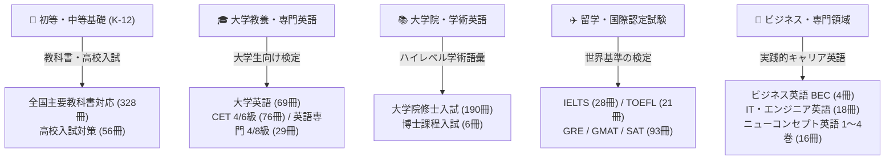

  

  # 🌐 総合英語ボキャブラリー・ヴォールト (English Vocabulary Vault)

  

    <strong>960冊以上の英単語帳を網羅 • 国際音声記号 (IPA) 準拠 • Anki / Quizlet / Excel 即時インポート対応</strong>
  

  

    <a href="./README.md">🇬🇧 English</a> &nbsp;•&nbsp;
    <a href="./README_zh.md">🇨🇳 简体中文</a> &nbsp;•&nbsp;
    <a href="./README_ja.md"><b>🇯🇵 日本語</b></a> &nbsp;•&nbsp;
    <a href="./README_es.md">🇪🇸 Español</a>
  

  

    
    
    
    
    
    
    
  

  

    🚀 世界中の英語学習者のためのオープンソース英単語データベース。基礎英語から大学・大学院入試、IELTS・TOEFL、エンジニア向けIT英語まで、高品質な語彙リソースをワンストップで提供します。
  

---

## 📑 目次

- [📖 プロジェクト概要](#-プロジェクト概要)
- [🌟 特徴と強み](#-特徴と強み)
- [🎯 学習ステージ別マップ](#-学習ステージ別マップ)
- [📂 収録ボキャブラリー全覧 (960+ 冊)](#-収録ボキャブラリー全覧-960-冊)
- [🏆 注目の特化型リソース](#-注目の特化型リソース)
  - [🎓 IELTS 対策シリーズ (28 冊)](#-ielts-対策シリーズ-28-冊)
  - [✈️ TOEFL iBT 対策シリーズ (21 冊)](#️-toefl-ibt-対策シリーズ-21-冊)
  - [📘 ニューコンセプト英語 (テキスト 1〜4 巻 + 108 講義ノート)](#-ニューコンセプト英語-テキスト-14-巻--108-講義ノート)
  - [💻 IT・プログラマー専門英語](#-itプログラマー専門英語)
- [🛠️ ツール連携・インポート手順](#️-ツール連携インポート手順)
  - [📱 Anki へのインポート手順 (分散学習)](#-anki-へのインポート手順-分散学習)
  - [📝 Quizlet へのインポート手順](#-quizlet-へのインポート手順)
- [📋 データ構造標準 (Schema)](#-データ構造標準-schema)
- [🗺️ ロードマップ](#️-ロードマップ)
- [🤝 コントリビューション・参加案内](#-コントリビューション参加案内)
- [⭐ Star History](#-star-history)
- [📄 免責事項・ライセンス](#-免責事項ライセンス)

---

## 📖 プロジェクト概要

英語の語彙学習において、**正確な発音記号（IPA）が付き、表記ゆれや文字化けのない高品質な単語リスト**を探すのは容易ではありません。

**English Vocabulary Vault** は、学習リソースの断片化を解消するために構築されたオープンソース単語帳プロジェクトです：
- **圧倒的な網羅性**：初等・中等教育、大学英語、大学院入試、IELTS、TOEFL、GRE、GMAT、SAT、ビジネス英語、IT・プログラミング英語まで **960冊以上** の単語集を収録。
- **データ標準化**：全データを `.xlsx` や `.txt` 形式で整備。国際音声記号（IPA）を完備。
- **暗記アプリ完全対応**：Anki や Quizlet などのフラッシュカードアプリへ数クリックで直接インポート可能。

---

## 🌟 特徴と強み

| 項目 | 詳細 |
| :--- | :--- |
| **📦 960+ 冊の膨大ライブラリ** | 総数数十万語に及ぶ単語データを整理。単一のリポジトリとして屈指の規模を誇ります。 |
| **🗂️ 階層別整理** | 学年、試験の種類、実用分野ごとにフォルダ分けされており、必要な単語帳をすぐ見つけられます。 |
| **✨ 正確な発音記号 (IPA)** | 国際標準の IPA 発音記号を収録。文字化けを防止し、スピーキングとリスニングの向上を支援。 |
| **🔄 正順・乱順の両対応** | 頻出試験対策単語帳には「アルファベット順」と「ランダム順（乱序）」の両方を用意し、位置記憶の偏りを防止。 |
| **📑 充実の講義資料** | 単語リストだけでなく、名著『ニューコンセプト英語』の **108講義分にわたる詳細解説ノート (Docx/PDF)** を同梱。 |
| **🆓 完全オープンソース** | コミュニティの貢献により、誰でも無料で自由に学習に活用できます。 |

---

## 🎯 学習ステージ別マップ

---

## 📂 収録ボキャブラリー全覧 (960+ 冊)

各ディレクトリリンクをクリックすると、該当フォルダの単語ファイル一覧へ直接移動できます：

| 区分 | ディレクトリ名 | 収録冊数 | 主な内容 |
| :-: | :--- | :-: | :--- |
| **01** | [1.全国各大教材版本中小学同步](./1.全国各大教材版本中小学同步/) | **328 冊** | 各学年・各出版社対応の基礎学習単語帳（小学〜高校） |
| **02** | [2.中考](./2.中考/) | **9 冊** | 高校入試（中考）必須基本語彙、頻出イディオム、ポケット単語帳 |
| **03** | [2.高考](./2.高考/) | **47 冊** | 大学入学共通テスト相当（高考 3500語）、直前対策、ランダム順単語帳 |
| **04** | [3.大学英语](./3.大学英语/) | **69 冊** | 大学一般教養英語、アカデミックリーディング、語彙強化 |
| **05** | [3.四级](./3.四级/) | **30 冊** | 大学英語検定4級（CET-4）頻出語彙、大綱完全版 |
| **06** | [3.专四](./3.专四/) | **15 冊** | 英語専攻生向け4級（TEM-4）必須語彙、文脈記憶型単語帳 |
| **07** | [4.六级](./4.六级/) | **46 冊** | 大学英語検定6級（CET-6）中上級語彙、スピード暗記版 |
| **08** | [4.专八](./4.专八/) | **14 冊** | 英語専攻生向け8級（TEM-8）最上級語彙・文学語彙 |
| **09** | [5.考研](./5.考研/) | **190 冊** 🔥 | 大学院修士課程入試英語（考研）、過去問頻出単語、難解語彙集 |
| **10** | [6.研究生](./6.研究生/) | **9 冊** | 大学院修士課程在学中の高度学術英語・論文講読語彙 |
| **11** | [6.考博](./6.考博/) | **6 冊** | 博士課程（PhD）入試 10,000語レベル語彙集 |
| **12** | [7.雅思](./7.雅思/) | **28 冊** 🏆 | IELTS分野別語彙、リスニング/スピーキング頻出語（王陸807）、公式過去問単語 |
| **13** | [7.托福](./7.托福/) | **21 冊** 🏆 | TOEFL iBT アカデミック頻出単語、21日間集中突破、ランダム順語彙 |
| **14** | [8.商务英语](./8.商务英语/) | **4 冊** | ケンブリッジ実用ビジネス英語検定（BEC）初級・中級・上級 |
| **15** | [8.国际英语](./8.国际英语/) | **12 冊** | Cambridge Interchange、Longman Side by Side シリーズ |
| **16** | [8.新世纪英专](./8.新世纪英专/) | **12 冊** | 英語専攻生向け統合コース（第1〜8分冊） |
| **17** | [8.新概念英语](./8.新概念英语/) | **16 冊 + ノート** | ニューコンセプト英語 1〜4巻、**第3・4巻講義ノート（計108課 Docx/PDF）** |
| **18** | [9.扇贝英语（IT）](./9.扇贝英语（IT）/) | **18 冊** 💻 | コンピュータ科学専門用語、Python/Java開発者向け頻出語、NAWL学術語彙 |
| **19** | [9.其他（更多）](./9.其他（更多）/) | **93 冊** | SAT、GRE Red Book、GMAT、語根・接辞記憶マニュアル、英字新聞頻出語 |

---

## 🏆 注目の特化型リソース

### 🎓 IELTS 対策シリーズ (28 冊)

スコア 7.0+ を目指す受験生のために、リスニング・スピーキング・リーディング・ライティングを多角的にサポート：
- `IELTS词汇词以类记.xlsx`：環境・教育・科学技術などのテーマ別語彙。ライティングとスピーキングの表現力強化に最適。
- `王陆807雅思词汇听力/口语/阅读/写作.xlsx`：正確なスペリングと聴取即答力を鍛える決定版。
- `雅思真词汇（第3-6版）.xlsx`：ケンブリッジ公式問題集の過去問を徹底分析した頻出単語。

---

### 📘 ニューコンセプト英語 (テキスト 1〜4 巻 + 108 講義ノート)

> 詳細案内は専用ガイドを参照：[8.新概念英语/README.md](./8.新概念英语/README.md)

- **単語シート (.xlsx)**：第1巻（基礎）〜第4巻（上級エッセイ）およびジュニア版全巻に対応。
- **講義ノート (.docx / .pdf)**：
  - 第3巻（Developing Skills）：第1課〜第60課の完全講義録。**47.4 MB の合本 PDF** を付属。
  - 第4巻（Fluency in English）：第1課〜第48課の修辞法・複文構造・高級エッセイ講義録。

---

### 💻 IT・プログラマー専門英語

海外就職、グローバル開発チームへの参加、オープンソース参加を目指すエンジニア向け：
- `计算机专业英语词汇.xls`：OS、分散システム、ネットワーク、アルゴリズム関連用語。
- `Python词汇（基础版）.xls` & `JAVA程序员英语通关单词.xls`：構文キーワード、例外、頻出フレームワーク用語。

---

## 🛠️ ツール連携・インポート手順

### 📱 Anki へのインポート手順 (分散学習)

1. ダウンロードした `.xlsx` ファイルを開き、「ファイル」→「名前を付けて保存」で **CSV (カンマ区切り) (\*.csv)**、文字コード **UTF-8** を選択して保存します。
2. [Anki](https://apps.ankiweb.net/) デスクトップ版を起動し、「ファイル」→「読み込み」をクリックします。
3. 保存した `.csv` ファイルを選択し、フィールド割り当てを設定します：
   - 第1列 → `Front (英単語)`
   - 第2列 → `Phonetic (発音記号)`
   - 第3列 → `Back (意味・語義)`
4. 「インポート」をクリックすると、Anki のエビングハウス忘却曲線アルゴリズムで科学的な暗記が開始されます。

### 📝 Quizlet へのインポート手順

1. [Quizlet](https://quizlet.com/) にログインし、「作成」→「単語カードセット」を選択します。
2. 「Word、Excel、Google Docs 等からインポート」をクリックします。
3. Excel 内の2列（例：「単語」と「意味」）をコピーし、Quizlet の入力欄に貼り付けます。
4. 区切り文字を「タブ」、行間を「改行」に指定して「インポート」を実行します。

---

## 📋 データ構造標準 (Schema)

| 列名 (中国語) | フィールド名 (英語) | データ型 | 説明・サンプル |
| :--- | :--- | :--- | :--- |
| **单词** | `Word` | String | 単語原形またはイディオム（例: `resilience`） |
| **音标** | `Phonetic` | String | 国際音声記号（IPA）（例: `/rɪˈzɪliəns/`） |
| **释义** | `Definition` | String | 品詞および語義（例: `n. 復元力、弾力性、回復力`） |
| **例句** *(一部)* | `Sentence` | String | 公式過去問の用例または実用例文 |

---

## 🗺️ ロードマップ

- [x] 960+ 冊の単語データ棚卸しと分類ディレクトリ整備の完了
- [x] ニューコンセプト英語 1〜4 巻と 108 講義ノート（Docx/PDF）の完全収録
- [x] 大手テック企業基準の多言語ドキュメント体系（英語・中国語・日本語・スペイン語）の実装
- [ ] **自動化ツール**：`.xlsx` から Anki 用 `.apkg` デッキを自動一括生成するオープンソーススクリプトの提供
- [ ] **データ精緻化**：発音記号の欠落や古風な語義の校正
- [ ] **Web 検索ツール**：GitHub Pages 上で動作する軽量オンライン単語検索ビューアの構築

---

## 🤝 コントリビューション・参加案内

世界中の学習者や開発者からの貢献を歓迎します！

1. 本リポジトリを **Fork** します。
2. ブランチを作成します：`git checkout -b fix/word-phonetic`
3. 修正をコミットします：`git commit -m "docs: correct phonetic for abandon"`
4. **Pull Request** を送信してください。確認後マージいたします。
5. 不具合報告や提案は [GitHub Issues](https://github.com/lilinji/English/issues) よりお気軽にお寄せください。

---

## ⭐ Star History

このプロジェクトが学習の役に立ちましたら、ぜひ右上の **Star** ⭐ を押して応援をお願いいたします！

---

## 📄 免責事項・ライセンス

> ⚠️ **免責事項 (Disclaimer)**
>
> 1. 本リポジトリに含まれる単語データおよび講義資料は、インターネット上で公開されている学習資源の収集およびコミュニティ有志による提供に基づいています。個人の非営利的な学習・学術研究・言語習得目的のみにご利用ください。
> 2. 原書の商標権・検定試験のシラバス等の権利は、各著者、出版社、または試験実施団体に帰属します。
> 3. 本コンテンツの営利目的での再配布・販売は固く禁止されています。権利者の方で掲載に問題がある場合は、Issue を通じて権利証明書を添えてご連絡ください。速やかに対応いたします。

---

  💡 **Empower Your Learning Journey — One Word at a Time.**
  
  **Made with ❤️ by [Ringi](https://github.com/lilinji) & Community Contributors**

  [⬆ トップへ戻る](#-総合英語ボキャブラリーヴォールト-english-vocabulary-vault)

