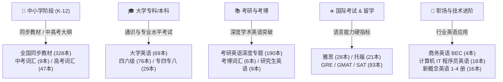

  

  # 🌐 全网最全英语单词词库 (English Vocabulary Vault)

  

    <strong>涵盖 960+ 本权威词书 · 国际标准音标 (IPA) · 权威释义 · Anki / Quizlet / 欧路词典完美兼容</strong>
  

  

    <a href="./README.md">🇬🇧 English</a> &nbsp;•&nbsp;
    <a href="./README_zh.md"><b>🇨🇳 简体中文</b></a> &nbsp;•&nbsp;
    <a href="./README_ja.md">🇯🇵 日本語</a> &nbsp;•&nbsp;
    <a href="./README_es.md">🇪🇸 Español</a>
  

  

    
    
    
    
    
    
    
  

  

    🚀 本项目致力于为全球英语学习者构建一站式、系统化、高质量的词汇资源宝库。从小学基础到考博学术，从雅思托福到程序员专业英语，应有尽有。
  

---

## 📑 目录导航

- [📖 项目愿景与简介](#-项目愿景与简介)
- [🌟 核心特色与优势](#-核心特色与优势)
- [🎯 适用人群与学习路径](#-适用人群与学习路径)
- [📂 词库全景索引 (960+ 词书)](#-词库全景索引-960-词书)
- [🏆 核心专项资源推荐](#-核心专项资源推荐)
  - [🎓 雅思专项 (IELTS Focus)](#-雅思专项-ielts-focus)
  - [✈️ 托福专项 (TOEFL Focus)](#️-托福专项-toefl-focus)
  - [📘 新概念英语全套专区 (含讲义与课文精析)](#-新概念英语全套专区-含讲义与课文精析)
  - [💻 计算机与 IT 程序员英语专项](#-计算机与-it-程序员英语专项)
- [🛠️ 软件导入与使用指南](#️-软件导入与使用指南)
  - [📱 导入 Anki (记忆曲线利器)](#-导入-anki-记忆曲线利器)
  - [📝 导入 Quizlet](#-导入-quizlet)
  - [📖 导入 欧路词典 / 有道 / 扇贝](#-导入-欧路词典--有道--扇贝)
- [📋 数据格式标准 (Schema)](#-数据格式标准-schema)
- [🗺️ 项目演进路线图 (Roadmap)](#️-项目演进路线图-roadmap)
- [🤝 社区贡献与协作指南](#-社区贡献与协作指南)
- [⭐ Star History](#-star-history)
- [📄 版权免责与开源声明](#-版权免责与开源声明)

---

## 📖 项目愿景与简介

在英语学习与备考过程中，寻找一套**分类科学、排版规整、音标标准且无格式错误**的生词本往往耗费大量精力。网络上的资源常常存在词库残缺、编码混乱、音标乱码、格式不兼容等问题。

**English Vocabulary Vault** 由社区发起并持续维护，旨在彻底终结词汇资源碎片化现状：
- **完整性**：收录全国主流中小学教材、中高考、大学四六级、专四专八、考研英语一/二、考博、雅思、托福、GRE、SAT、GMAT 以及新概念英语、计算机 IT 英语等共 **960+ 本**独立词汇册。
- **标准化**：统一规范为 `.xlsx`、`.txt` 格式，内建标准国际音标 (IPA) 及权威中文词义。
- **工具友好**：零门槛直导 Anki、Quizlet、欧路词典、不背单词等主流辅助记忆工具。

---

## 🌟 核心特色与优势

| 维度 | 特色描述 |
| :--- | :--- |
| **📦 规模宏大** | 覆盖 960+ 本词书、数十万级词条，可能是 GitHub 上分类最详尽的英语词库仓库。 |
| **🗂️ 阶梯分层** | 严格按学段、考试类别、专业场景划分目录，检索精准，开箱即用。 |
| **✨ 音标标准** | 采用规范 International Phonetic Alphabet (IPA) 字符集，杜绝常见乱码与缺字现象。 |
| **🔄 乱序 / 正序并行** | 重点备考词库（如四六级、考研、雅思）同步提供正序版与乱序版，打破字母位置记忆惯性。 |
| **📑 配套名师讲义** | 不仅有纯词表，新概念等核心专区更配套提供 **108 篇课文名师讲义与深度解析 (Docx/PDF)**。 |
| **🆓 永久开源免费** | 秉持开源共享理念，所有资源完全向社区开放，无任何收费套路。 |

---

## 🎯 适用人群与学习路径

---

## 📂 词库全景索引 (960+ 词书)

各目录结构清晰独立，点击对应分类即可直达文件夹浏览与下载：

| 序号 | 目录分类 | 词书数量 | 涵盖重点内容 |
| :---: | :--- | :---: | :--- |
| **01** | [1.全国各大教材版本中小学同步](./1.全国各大教材版本中小学同步/) | **328 本** | 人教版、外研版、北师大版、苏教版、冀教版、牛津版等小学到高中各学期同步词库 |
| **02** | [2.中考](./2.中考/) | **9 本** | 中考考纲核心词汇、中考常考短语、5·3 中考词汇、乱序及便携版 |
| **03** | [2.高考](./2.高考/) | **47 本** | 维克多英语、星火高考、高考考纲 3500 词、高频冲刺词汇、高考乱序记忆手册 |
| **04** | [3.大学英语](./3.大学英语/) | **69 本** | 全新版大学英语、新视野大学英语、新编大学英语及基础强化词汇 |
| **05** | [3.四级](./3.四级/) | **30 本** | 恋练有词、星火四级、四级闪过、淘金分频、大纲词汇正序/乱序版 |
| **06** | [3.专四](./3.专四/) | **15 本** | 英语专业四级大纲词汇、华研专四 8000 词、专四语境记忆、读名著学专四 |
| **07** | [4.六级](./4.六级/) | **46 本** | 六级核心词分类速记、星火六级、黄皮书词汇、考虫词汇减法、大纲乱序版 |
| **08** | [4.专八](./4.专八/) | **14 本** | 英语专业八级大纲词汇、星火专八巧记速记、华研专八核心突破 |
| **09** | [5.考研](./5.考研/) | **190 本** 🔥 | 考研红宝书、恋练有词、新东方词汇、真题核心考点、形近混淆词、高频分级词汇 |
| **10** | [6.研究生](./6.研究生/) | **9 本** | 研究生公共英语、新编研究生英语、研究生听说读写进阶词汇 |
| **11** | [6.考博](./6.考博/) | **6 本** | 考博 10000 词口袋书、考博词汇周计划、考博便携速记本 |
| **12** | [7.雅思](./7.雅思/) | **28 本** 🏆 | 词以类记、王陆 807 系列（听/说/读/写）、剑桥雅思真词汇、7天突破、乱序版 |
| **13** | [7.托福](./7.托福/) | **21 本** 🏆 | 托福词以类记、托福乱序版、21 天突破托福核心词汇、托福高阶必备 |
| **14** | [8.商务英语](./8.商务英语/) | **4 本** | BEC 初级/中级/高级核心词汇精选、BEC 乱序高频版 |
| **15** | [8.国际英语](./8.国际英语/) | **12 本** | 剑桥国际英语教程 (Interchange) 入门-3 册、朗文国际英语 (Side by Side) 1-4 册 |
| **16** | [8.新世纪英专](./8.新世纪英专/) | **12 本** | 高等院校英语专业综合教程（1-8 册及拓展词汇） |
| **17** | [8.新概念英语](./8.新概念英语/) | **16 本 + 讲义** | 新版 1-4 册词汇、青少版全套，**附第 3、4 册 108 篇名师讲义 Docx/PDF** |
| **18** | [9.扇贝英语（IT）](./9.扇贝英语（IT）/) | **18 本** 💻 | 计算机专业英语、Python/JAVA 程序员高频单词、考纲核心精简文本 |
| **19** | [9.其他（更多）](./9.其他（更多）/) | **93 本** | SAT、GRE 红宝书、GMAT 词汇、词根词缀记忆全书、专业外刊常考核心词 |

---

## 🏆 核心专项资源推荐

### 🎓 雅思专项 (IELTS Focus)

专为“屠鸭”考生定制，按认知记忆心理学与考试场景全方位分类：

| 模块类别 | 推荐书目 | 核心适用场景 |
| :--- | :--- | :--- |
| **📘 场景分类** | `IELTS词汇词以类记.xlsx` | 针对口语/写作 Topic 按主题背诵，关联记忆效果极佳 |
| **📙 听力/口语核心** | `王陆807雅思词汇听力/口语/阅读/写作.xlsx` | 考鸭人手必备，精准击破听力反应速度与拼写易错点 |
| **📗 真题精粹** | `雅思真词汇（第3-6版）.xlsx` | 源自剑桥雅思 4-17 真题考点提炼，原汁原味高频复现 |
| **⚡ 考前冲刺** | `7天搞定雅思高频核心词.xlsx` | 考前 1-2 周快速排查词汇盲点 |

---

### ✈️ 托福专项 (TOEFL Focus)

针对托福网考 (TOEFL iBT) 的学术跨学科场景，提供高阶专业学术词汇支撑：
- `TOEFL词汇词以类记.xlsx`：涵盖生物、地质、天文、艺术等学科高频背景词汇。
- `托福核心词汇21天突破.xlsx`：精选托福听力与阅读中反复出现的关键动词与形容词。
- `托福词汇乱序版.xlsx`：避免字母序背词死板，强化第一反射能力。

---

### 📘 新概念英语全套专区 (含讲义与课文精析)

> 详细目录索引与课文导读见专区说明：[8.新概念英语/README.md](./8.新概念英语/README.md)

本仓库提供行业最完整的《新概念英语》数字化研习套装：
1. **词汇表（.xlsx）**：
   - 经典版：第一册至第四册（含标准音标与精解）
   - 青少版：入门级 A/B 到 5A/5B 全套 12 本词书
2. **名师讲义与深度笔记（Docx / PDF）**：
   - **第三册（Developing Skills 培养技能）**：全套 Lesson 01 ~ Lesson 60 独立讲义，并附 **47.4 MB 全册精析合订版 PDF**。
   - **第四册（Fluency in English 流利英语）**：Lesson 01 ~ Lesson 48 完整讲义，涵盖文风赏析、复杂从句拆解与学术仿写。

---

### 💻 计算机与 IT 程序员英语专项

针对软件工程师、计算机专业学生与出海求职开发人员量身定制：
- `计算机专业英语词汇.xls`：涵盖计算机体系结构、操作系统、计算机网络核心专有名词。
- `Python词汇（基础版）.xls` & `JAVA程序员英语通关单词.xls`：覆盖语法关键字、异常类型、流行框架常用 API 词汇。
- `雅思NAWL学术词汇.txt`：海外学术论文与技术白皮书高频学术词汇表。

---

## 🛠️ 软件导入与使用指南

本仓库词库主要采用通用 `.xlsx` 格式存储，具有极强的跨软件兼容性。

### 📱 导入 Anki (记忆曲线利器)

1. 打开 Excel 词库文件，点击 `文件` -> `另存为`，选择保存格式为 **CSV (逗号分隔) (\*.csv)**，编码选择 **UTF-8**。
2. 启动 [Anki](https://apps.ankiweb.net/) 桌面端，点击菜单栏 `文件 (File)` -> `导入 (Import)`。
3. 选取刚保存的 `.csv` 文件，在弹出的导入设置窗口中：
   - **卡片类型**：推荐选择 `Basic` 或自建的音标卡片模板。
   - **字段映射**：
     - 字段 1 映射为 `Front (正面/英文)`
     - 字段 2 映射为 `Phonetic (音标)`
     - 字段 3 映射为 `Back (背面/释义)`
4. 点击 `导入`，即可根据 Anki 艾宾浩斯间隔重复算法开始科学记忆！

### 📝 导入 Quizlet

1. 登录 [Quizlet 官网](https://quizlet.com/)，点击顶部 `创建` -> `学习集`。
2. 点击卡片下方的 `从表格/Word/Excel 导入`。
3. 在 Excel 词库中选中两列（如：“单词”与“释义”），按 `Ctrl+C` 复制。
4. 粘贴至 Quizlet 文本框中，分隔符选择“制表符 (Tab)”，行之间选择“换行”。
5. 点击 `导入`，随后保存学习集，可在手机 App 端随时进行卡片划词与拼写练习。

### 📖 导入 欧路词典 / 有道 / 扇贝

- **欧路词典 (Eudic)**：在电脑端进入 `生词本` -> `管理生词本` -> `导入生词`，直接支持 Excel 格式解析。
- **有道词典 / 扇贝单词**：将对应生词转为纯文本每行一个单词的 `.txt` 格式，直接通过桌面端导入生词本即可同步至移动端。

---

## 📋 数据格式标准 (Schema)

为保证全库数据的高质量与工具兼容性，词库遵循以下统一的数据规范：

| 字段名称 | 英文字段名 | 类型 | 说明与示例 |
| :--- | :--- | :--- | :--- |
| **单词** | `Word` | String | 英文单词原型或短语，如 `resilience` |
| **音标** | `Phonetic` | String | 规范 IPA 国际音标（含斜杠），如 `/rɪˈzɪliəns/` |
| **释义** | `Definition` | String | 词性 + 中文权威释义，如 `n. 恢复力；弹力；适应力` |
| **例句** *(部分)* | `Sentence` | String | 经典真题例句或地道用法场景 |

---

## 🗺️ 项目演进路线图 (Roadmap)

- [x] 完成 960+ 词书全景盘点与分类索引体系搭建
- [x] 深度集成新概念 1-4 册全套词库与 108 篇课文名师讲义 (Docx/PDF)
- [x] 建立大厂标准多语言文档体系 (English / 中文 / 日本語 / Español)
- [ ] **自动化构建工具**：编写 Python 开源脚本，支持一键批量将 `.xlsx` 编译为 Anki `.apkg` 卡牌包
- [ ] **词库精校工程**：利用大模型与社区协作纠正历史词书中生僻词义与音标缺失
- [ ] **剑桥雅思 18/19 最新真题词库**补充与整合
- [ ] **Web 在线词典检索器**：部署基于 GitHub Pages 的轻量级纯前端检索工具

---

## 🤝 社区贡献与协作指南

我们热烈欢迎来自全球英语学习者与技术爱好者的参与！如果你发现了任何音标/拼写勘误，或手中有优质的公开词库想要共享：

1. **Fork 本仓库** 到你自己的 GitHub 账号。
2. **新建分支** 进行修改：`git checkout -b feature/awesome-words`
3. **提交规范 Commit**：`git commit -m "docs: 纠正四级词库中 abandon 音标"`
4. **发起 Pull Request**，我们在审核后会第一时间合并并记录贡献者名单。
5. 发现问题亦可随时在 [GitHub Issues](https://github.com/lilinji/English/issues) 提交反馈。

---

## ⭐ Star History

如果这个词库仓库帮助到了你的英语学习或备考冲刺，欢迎点亮右上角的 **Star** ⭐ 支持我们！

---

## 📄 版权免责与开源声明

> ⚠️ **免责声明 (Disclaimer)**
>
> 1. 本仓库所包含的所有词汇资料与讲义笔记均来源于互联网公开学习资源的整合与爱好者社区贡献，仅供个人非商业性学习、研究和语言能力提升使用。
> 2. 词库内涉及的原书商标、考纲版权均归原作者、出版社或对应考试主办官方机构所有。
> 3. 任何个人或组织严禁将本仓库内容打包用于任何商业盈利行为。如权利人认为内容侵犯了您的合法权益，请提交 Issue 并提供权属凭证，我们将依法在第一时间内配合清理与下架。

---

  💡 **Empower Your Learning Journey — One Word at a Time.**
  
  **Made with ❤️ by [Ringi](https://github.com/lilinji) & Community Contributors**

  [⬆ 回到顶部](#-全网最全英语单词词库-english-vocabulary-vault)

